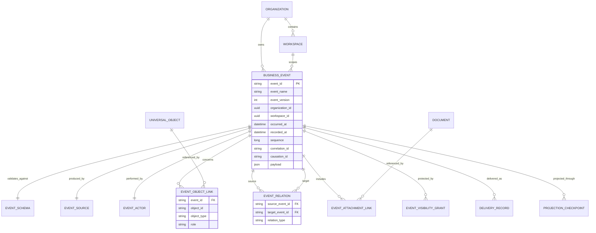
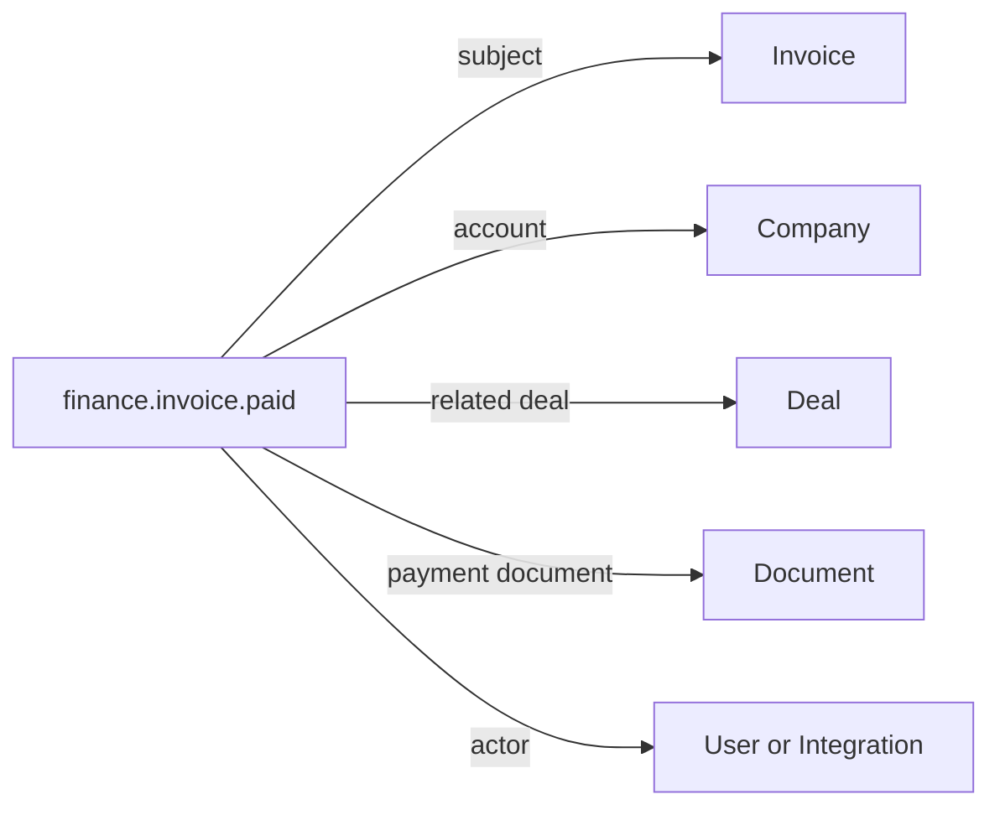
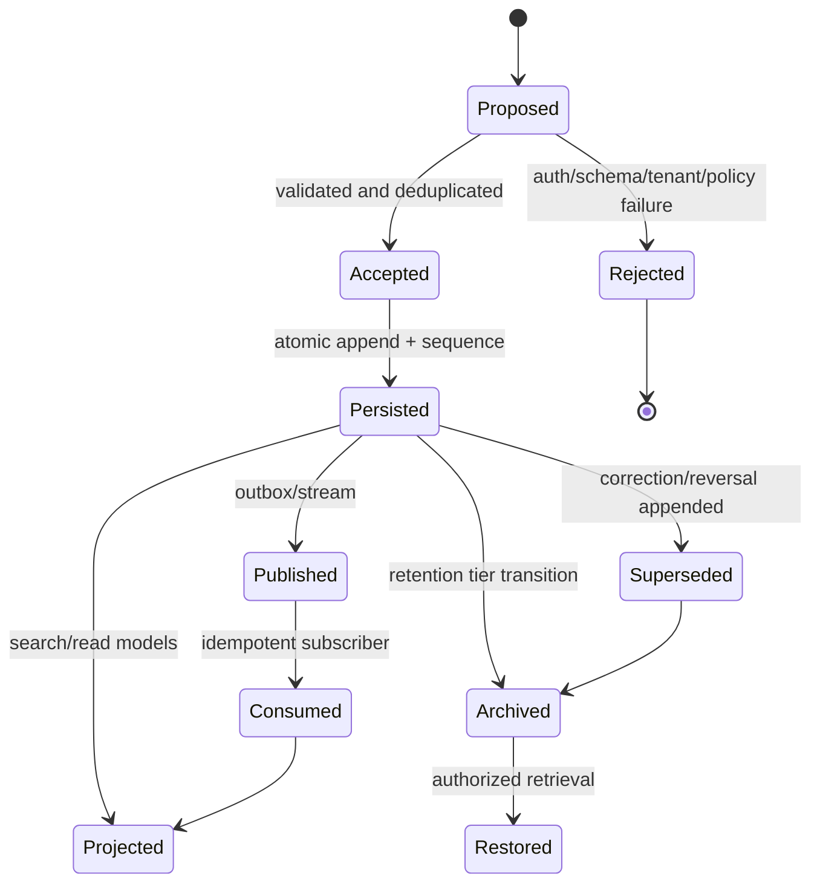

# Vayon OS Business Timeline Architecture

## 1. Purpose and scope

The Business Timeline is the canonical, append-only history of meaningful business facts in Vayon OS. It provides one event backbone for Sales, Growth, Communications, Operations, Finance, Documents, Workforce, the Intelligence Platform, Vayon Brain, the Cognitive Engine, the AI Runtime, and future integrations and industries.

The Timeline is not a replacement for transactional module databases, an event-sourcing requirement for every aggregate, a message broker, an audit log, or an analytics warehouse. It is a stable business-history boundary that can project facts from those systems while preserving provenance, tenancy, ordering, and explainability.

This document is architecture only. It proposes no immediate database migration, API implementation, provider integration, or UI.

### 1.1 Design principles

1. Business facts are immutable after acceptance.
2. Corrections append new facts; they never rewrite history.
3. Tenant scope is mandatory and cannot be inferred from client input alone.
4. Event names describe completed facts in past tense.
5. Domain payloads remain owned by their producing modules.
6. Universal Business Objects provide canonical subject references.
7. Provenance, correlation, causation, and schema version are first-class.
8. Delivery may be at least once; business effects must be idempotent.
9. Sensitive payloads are minimized, classified, and access-controlled.
10. AI consumes governed event references, not unrestricted event storage.
11. Audit, analytics, search, and streaming are projections, not competing sources of truth.
12. Storage and transport implementations remain replaceable.

## 2. What is a Business Event?

A Business Event is an immutable statement that a business-relevant fact occurred at a known effective time, was observed or recorded at a known system time, belongs to one tenant boundary, concerns one or more business objects, and has traceable provenance.

Examples include `sales.lead.created`, `sales.deal.stage_changed`, `growth.campaign.scheduled`, `communication.message.received`, `operations.task.completed`, `finance.invoice.paid`, `documents.document.uploaded`, and `governance.approval.granted`.

A Business Event must:

- describe something that has already happened;
- have durable business meaning independent of a UI screen;
- identify its organization and workspace scope;
- identify its primary subject and optional related objects;
- include event, schema, correlation, source, and time metadata;
- contain enough non-sensitive information to understand the fact;
- link to protected detail rather than duplicating secrets or large content;
- pass schema, authorization, tenancy, and idempotency validation.

A command such as “send email” is not an event. `communication.email.send_requested` may be an event recording an accepted request, while `communication.email.sent` records the confirmed outcome. A mutable row snapshot is not an event. A UI click is not normally a business event unless it represents a governed action such as approval or consent.

## 3. Canonical event envelope

The logical envelope below is storage- and transport-neutral.

| Field | Purpose |
|---|---|
| `event_id` | Globally unique, time-sortable event identity |
| `event_name` | Stable taxonomy name, such as `sales.deal.won` |
| `event_version` | Version of the named business-event contract |
| `envelope_version` | Version of the common Timeline envelope |
| `organization_id` | Mandatory tenant root |
| `workspace_id` | Mandatory operational scope unless explicitly organization-global |
| `partition_key` | Server-derived physical ordering/partition key |
| `subject` | Primary Universal Business Object reference |
| `related_objects` | Typed references participating in the event |
| `actor` | User, service, integration, workforce employee, or system actor |
| `owner` | Business owner/team responsible for the event context |
| `source` | Producing module/provider and trust metadata |
| `occurred_at` | When the fact was effective in the business domain |
| `recorded_at` | When Vayon accepted the event |
| `received_at` | When an external or offline message reached ingestion |
| `sequence` | Monotonic sequence within the ordering partition |
| `correlation_id` | Groups one end-to-end business interaction |
| `causation_id` | Identifies the command or event that directly caused this event |
| `idempotency_key` | Producer-scoped duplicate-prevention key |
| `category` | Broad functional classification |
| `priority` | Processing/business attention priority |
| `severity` | Business impact severity |
| `visibility` | Normal, restricted, confidential, or system-only |
| `payload` | Versioned, schema-validated domain facts |
| `summary` | Safe human-readable rendering hint, not canonical truth |
| `data_classification` | Public, internal, confidential, restricted, regulated |
| `retention_class` | Retention and archival policy identifier |
| `supersedes_event_id` | Optional correction/replacement relationship |
| `derived_from` | Source event IDs for derived facts |
| `trace_id` | Cross-system observability reference |
| `integrity` | Optional hash/signature metadata |

The primary subject uses a stable Universal Object reference: `{ object_id, object_type, object_version?, display_hint? }`. Display hints are non-authoritative and may be stale.

## 4. Entity model

### 4.1 Event-to-event relations

Supported relations include `caused`, `correlated`, `supersedes`, `corrects`, `reverses`, `derived_from`, `approves`, `rejects`, `fulfills`, `retries`, `replays`, and `duplicates`. The common envelope retains the most frequent direct fields; a relation collection supports many-to-many lineage.

## 5. Immutable and derived events

### 5.1 Immutable events

Every accepted canonical Business Event is immutable. The following are especially important immutable facts:

- externally confirmed communications and delivery receipts;
- approvals, rejections, delegations, and revocations;
- financial authorizations, charges, refunds, invoices, payments, and reversals;
- legal, consent, compliance, and retention decisions;
- document uploads, signatures, versions, and verification outcomes;
- identity-sensitive access and administrative actions;
- lifecycle transitions such as deal won, task completed, or campaign launched;
- integration receipts and import outcomes.

Immutability covers envelope and payload. Operational metadata such as projection delivery attempts must live in separate mutable delivery records.

### 5.2 Derived events

Derived events are immutable outputs calculated from one or more canonical events or governed snapshots. Examples include `intelligence.pipeline.risk_detected`, `analytics.conversion_rate.calculated`, or `workforce.follow_up.recommended`.

Derived events must include:

- all source event IDs, or a durable query/checkpoint reference when the set is very large;
- algorithm, ruleset, prompt, and model version where applicable;
- confidence and limitations;
- generation time and source data watermark;
- permission context used during derivation;
- expiration or staleness policy;
- a `derived` source kind.

Derived events never overwrite their sources. A recalculation appends a new derived event that supersedes the earlier result. Recommendations are facts that a recommendation was produced—not proof that its proposed action is correct.

## 6. Universal Business Object linkage

Each event has exactly one primary subject and zero or more related object links. Every link has a semantic role such as `subject`, `actor`, `recipient`, `account`, `property`, `lead`, `deal`, `campaign`, `document`, `invoice`, `task`, `meeting`, `parent`, or `affected`.

Object links store canonical IDs and types, never copied object payloads. This enables one event to appear on several object timelines without duplication. Deleting or anonymizing a business object must not destroy regulated event history; the link can resolve to a tombstone or privacy-safe identity.

Modules own object authorization. Timeline authorization is the intersection of tenant scope, event visibility, module permission, object permission, field classification, and purpose-of-use policy.

## 7. Event taxonomy and naming

### 7.1 Naming convention

Use lowercase dot-separated names:

`<domain>.<aggregate>.<past_tense_fact>`

Examples:

- `sales.lead.created`
- `sales.deal.stage_changed`
- `growth.campaign.scheduled`
- `communication.message.received`
- `operations.task.completed`
- `finance.payment.failed`
- `documents.document.version_added`
- `governance.approval.granted`
- `integration.sync.completed`
- `workforce.recommendation.generated`

Names must not include tenant names, provider-specific versions, UI pages, or volatile implementation details. Breaking semantic changes require a new event name; compatible payload evolution increments `event_version`.

### 7.2 Categories

| Category | Examples |
|---|---|
| `sales` | Leads, opportunities, deals, properties, viewings |
| `growth` | Campaigns, content, forms, referrals, attribution |
| `communication` | Messages, calls, meetings, delivery outcomes |
| `operations` | Tasks, workflows, assignments, service delivery |
| `finance` | Quotes, invoices, payments, refunds, subscriptions |
| `documents` | Files, versions, signatures, extraction, verification |
| `customer` | Contacts, companies, lifecycle, success, support |
| `governance` | Approvals, permissions, consent, policy decisions |
| `integration` | Imports, synchronization, webhooks, provider health |
| `workforce` | Advisory sessions, recommendations, approval requests |
| `intelligence` | Knowledge, predictions, risks, insights |
| `platform` | Workspace, organization, configuration, releases |
| `audit` | Security- or compliance-specific audit projections |

### 7.3 Priority and severity

Priority controls attention and processing, while severity describes impact. They must not be conflated.

- Priority: `low`, `normal`, `high`, `urgent`.
- Severity: `informational`, `success`, `warning`, `error`, `critical`.

A successful high-value payment may have high priority and success severity. A background synchronization warning may have normal priority and warning severity. Producers supply a proposed value; ingestion policy may normalize it.

## 8. Source, actor, and ownership model

### 8.1 Event source

The source identifies where the fact originated:

- `user_action`: authenticated manual action;
- `domain_service`: authoritative Vayon module;
- `workflow`: configured automation;
- `integration`: external system or webhook;
- `import`: controlled batch ingestion;
- `workforce`: advisory or future governed execution layer;
- `intelligence`: derived analysis;
- `system`: platform lifecycle process;
- `offline_client`: delayed synchronized client operation.

Source metadata includes producer ID, module, deployment/version, integration connection, external event ID, trust level, authentication method, and original timestamp when permitted.

### 8.2 Actor

Actor and source differ. A user may act through the Sales module; an integration may report an action performed by an external user. Actor types include `user`, `service_account`, `integration`, `workforce_employee`, `system`, `anonymous_external`, and `unknown_external`.

### 8.3 Ownership

Ownership states which business party is accountable for the event context. It may reference a user, team, workspace, or organization. Ownership is captured at occurrence time for historical accuracy. Later reassignment appends an ownership-change event and does not rewrite earlier ownership.

## 9. Identity, correlation, causation, and deduplication

### 9.1 Event IDs

Use UUIDv7 or an equivalent globally unique, time-sortable 128-bit identifier generated by the trusted ingestion boundary. IDs must not embed tenant data. Client-generated provisional IDs may be accepted for offline synchronization only after validation and canonical mapping.

### 9.2 Correlation IDs

A correlation ID groups all events, commands, approvals, provider attempts, and traces belonging to one business interaction. It propagates across synchronous calls, queues, workflows, Brain, Cognitive Engine, Runtime, and integrations. Entry points create one when absent; downstream services never silently replace it.

### 9.3 Causation IDs

The causation ID points to the immediately preceding command ID or event ID. This creates a causal chain within the broader correlation. Root events have no causation ID or point to a durable request/command ID.

### 9.4 Duplicate prevention

Deduplication occurs at several layers:

1. Producers supply an idempotency key for every retryable write.
2. Integrations preserve external provider event/message IDs.
3. Ingestion enforces uniqueness on `(organization, workspace, producer, idempotency_key)`.
4. Provider receipts enforce `(connection, external_event_id, external_event_version)`.
5. Offline operations enforce `(device, client_operation_id)`.
6. Canonical event IDs are unique globally.
7. Consumers maintain inbox/checkpoint deduplication by event ID.

Payload hashes may detect suspicious near-duplicates but must not replace explicit idempotency because legitimate repeated actions can have identical payloads. A duplicate attempt returns the existing canonical event identity and never creates a second business fact.

## 10. Versioning and correction

Three independent versions exist:

- Envelope version: common metadata structure.
- Event version: payload contract for one event name.
- Producer version: emitting module or integration implementation.

Compatible changes add optional fields or enum values with documented unknown-value behavior. Breaking changes require either a new event version with an upcaster or a new event name when semantics change.

Consumers declare supported versions. Read APIs may upcast old payloads into a requested logical version without mutating stored events. Original bytes and validation schema remain retained.

Incorrect facts are corrected by appending `*.corrected`, `*.reversed`, or a domain-specific compensating event. The correction references `supersedes_event_id` or a relation. UI projections present the effective history while allowing authorized users to inspect the immutable chain.

## 11. Event lifecycle

Acceptance must atomically persist the event and its outbox record or use a transactional-log capture pattern. Publication status is operational metadata, not a mutation to the Business Event.

## 12. Time and ordering

Store timestamps as UTC instants with microsecond precision where supported. Preserve original timezone and offset as metadata when legally or operationally relevant.

- `occurred_at`: domain-effective time, possibly supplied externally.
- `recorded_at`: trusted server commit time.
- `received_at`: ingestion arrival time.
- `available_at`: optional future delivery time.

Never guarantee a single global order across all tenants. Guarantee total order only within a declared partition such as `(organization_id, workspace_id, subject_type, subject_id)` or a workspace shard. `sequence` is assigned at acceptance within that partition. Cross-partition views use `(occurred_at, recorded_at, event_id)` as deterministic display order but do not imply causality.

Late and offline events retain their original `occurred_at` and later `recorded_at`. Projections must support watermarking and correction. Clock skew is recorded, bounded by policy, and never silently rewritten.

## 13. Archival, retention, deletion, and privacy

Events transition between hot, warm, cold, and legally held storage tiers without changing identity or logical API semantics.

- Hot: recent events and active object timelines.
- Warm: compressed indexed history.
- Cold: immutable object storage with manifests and integrity checks.
- Legal hold: retention override preventing disposal.

Retention is chosen from event category, jurisdiction, contract, organization policy, and data classification. Archival is not deletion. Archived events remain discoverable through metadata and can be restored asynchronously.

Privacy erasure must reconcile legal retention with data minimization. Prefer tokenized object IDs, redaction overlays, encrypted payload fields with destroyable keys, and privacy-safe tombstones. Never mutate regulated financial or audit facts merely to update display data. Search indexes and caches must honor redaction and deletion propagation.

## 14. Search and filtering

The append store is not the primary search engine. An authorization-aware Timeline Search projection indexes permitted metadata and selected safe payload fields.

Search dimensions include:

- organization and workspace;
- primary or related object;
- event name, domain, category, and version;
- actor, source, owner, and assignee;
- occurred/recorded time ranges;
- priority, severity, visibility, and classification;
- labels, correlation ID, causation ID, external ID;
- document or communication reference;
- safe full-text summary and explicitly approved payload fields;
- derived/canonical status, superseded state, and archive tier.

Every query must begin with a server-established tenant scope. Object-level authorization is applied before result materialization. Restricted payloads must not leak through snippets, facet counts, autocomplete, timing, or export.

Use cursor pagination based on stable ordering keys; avoid deep offset pagination. Search results include an index watermark so clients understand freshness. Exact event retrieval may fall back to the canonical store after authorization.

## 15. Subscription model

Subscribers declare:

- tenant/workspace scope;
- event-name patterns or explicit names;
- optional object types and categories;
- minimum envelope/event versions;
- delivery target and consumer identity;
- replay starting point;
- ordering partition expectation;
- retry and dead-letter policy;
- data-classification clearance.

Internal subscriptions use durable consumer groups with at-least-once delivery. Exactly-once delivery is not promised; idempotent handling and checkpointing are mandatory. External webhooks receive a signed, minimized projection rather than the unrestricted canonical event.

Subscription authorization is evaluated both at registration and delivery. Permission revocation stops future delivery and may require downstream deletion under policy. Replay is an audited operation with explicit time/event bounds and rate controls.

## 16. Domain representation guidance

### 16.1 Manual user actions

The application submits an authenticated command. The owning domain validates authorization and business rules, changes its transactional state, and appends an event through an outbox in the same transaction. Clients do not directly author canonical Business Events. Actor, tenant, correlation, and source are derived server-side.

### 16.2 Integrations

Integrations first persist a verified receipt containing provider identity, signature status, external ID, and raw-payload reference. An adapter normalizes the receipt into a domain command or event proposal. The owning domain validates meaning and scope before canonical append. Raw external payloads remain quarantined and access-controlled; they are not Timeline payloads.

### 16.3 Approvals

Represent request, step assignment, delegation, escalation, grant, rejection, expiration, revocation, and fulfillment as separate immutable events. Approval events link the proposal, affected objects, policy/rule version, approver, reason classification, and resulting action. Sensitive free-text reasons may be stored separately and referenced.

### 16.4 Documents

Events include uploaded, version added, classified, linked, viewed when auditable, shared, signature requested, signed, verified, expired, archived, and deleted. Store document IDs, version IDs, safe metadata, hashes, and classification—not file contents or signed URLs. OCR/extraction results are derived events with processor version and source page references.

### 16.5 Communication

Events cover received, send requested, queued, sent, delivered, read, failed, bounced, opted out, call logged, meeting scheduled, and internal note added. Message bodies and attachments should live in a protected communication store; Timeline events contain IDs, channel, direction, delivery state, participants as protected references, and a redacted summary where authorized.

### 16.6 Financial transactions

Financial facts are immutable and use decimal minor-unit or precise decimal representations with explicit ISO currency. Events distinguish authorization, capture, settlement, invoice, payment, refund, dispute, write-off, and reversal. Corrections use compensating events. Provider transaction IDs are tokenized, and card/bank secrets never enter the Timeline. Ledger systems remain authoritative; Timeline provides business history.

## 17. Workforce, Brain, Cognitive Engine, and AI Runtime

### 17.1 Workforce advisors

Workforce advisors never query the canonical event store directly. They request a permission-scoped Timeline context through Vayon Brain. The resolver returns bounded event references, safe summaries, freshness watermark, and pagination/continuation metadata. Cognitive Engine decisions list the event references used, their relevance, and limitations.

### 17.2 AI provider references

AI providers never receive unrestricted event envelopes. AI Runtime receives a prepared context containing opaque event reference IDs and the minimum permitted excerpts. Provider prompts use stable citation handles such as `evt_01...`, not internal storage coordinates. Tools cannot resolve a handle without tenant and user authorization.

### 17.3 Explainability

Every generated summary, recommendation, prediction, or decision records:

- cited event IDs and optional object links;
- the event version actually evaluated;
- the Timeline/search watermark;
- source reliability and event age;
- excluded or unavailable context;
- transformation, ruleset, prompt, and model versions;
- confidence and limitations.

An explanation must survive model changes. It references immutable source events and the immutable generated-decision event, while mutable presentation text is a projection.

## 18. Audit compatibility

Business Timeline and security audit serve different purposes.

- Timeline answers “what business fact occurred?”
- Audit answers “who accessed or attempted to change what system resource, under which authorization?”

Some actions create both records, linked by correlation and trace IDs. Audit events may contain security-sensitive details unsuitable for ordinary timelines. The audit store may require stronger retention, tamper evidence, restricted operators, and independent access logging. Never derive the only audit record from a user-visible Timeline projection.

Integrity options include append-only privileges, write-once archives, hash chaining per partition, signed manifests, periodic external anchoring, and reconciliation reports. Cryptographic integrity supplements—not replaces—authorization and operational controls.

## 19. Analytics compatibility

Analytics consumes a versioned event export or stream and builds facts/dimensions in a warehouse or lakehouse. It must not run unbounded aggregation against the canonical append store.

Each exported record includes event and schema versions, tenant keys, occurred/recorded dates, safe object keys, correction/reversal semantics, and a projection watermark. Analytics pipelines must be idempotent, support late arrivals, retractions through compensating facts, slowly changing dimensions, and backfills by checkpoint.

Metric definitions live outside event payloads. An event records `finance.invoice.paid`; a governed metric defines how paid revenue is calculated. This prevents dashboard semantics from contaminating domain facts.

## 20. Security and multi-tenant isolation

Tenant scope is part of every storage key, index, cache key, queue partition, subscription, search document, archive manifest, encryption context, and observability record.

Required boundaries:

- derive tenant identity from authenticated server context;
- reject payload/envelope tenant disagreement;
- apply database RLS or equivalent defense in depth;
- use tenant-aware encryption keys for restricted payloads;
- prevent cross-tenant correlation and search facets;
- authorize primary and related object visibility;
- minimize payloads at subscription and AI boundaries;
- separate internal/system-only events from customer timelines;
- audit privileged replay, export, restore, and redaction;
- prohibit service-role credentials in client runtimes;
- validate integration connection ownership before normalization.

Events containing mixed-visibility objects should either use the strictest visibility or emit safe audience-specific projections. Do not duplicate canonical facts merely to implement access control.

## 21. Performance and scalability to billions of events

### 21.1 Storage

Use an append-optimized canonical store partitioned first by tenant/workspace shard and time, with event ID and object-link indexes. Separate wide/large payloads into encrypted blob storage referenced by digest. Avoid updating event rows. Keep object links in a narrow indexable structure.

### 21.2 Read models

Build dedicated projections for:

- object timeline;
- workspace recent activity;
- unified search;
- unread/pending/action queues;
- correlation/causation graph;
- compliance/audit views;
- analytics export;
- AI context retrieval.

Projections checkpoint by partition and sequence. They are disposable and rebuildable from canonical events plus redaction/retention overlays.

### 21.3 Partitioning and hot spots

Do not partition only by organization: very large tenants create hot partitions. Use a stable workspace/subject hash shard plus time bucket. Preserve per-subject order using subject partition keys. High-volume communication and telemetry-style events may use specialized physical streams while sharing the logical envelope.

### 21.4 Caching

Cache only permission-safe view models. Keys include tenant, user/role permission version, query hash, and projection watermark. Short-lived caches are invalidated by checkpoint advance or permission changes. Never cache restricted payloads in shared public layers.

### 21.5 Capacity strategy

At billion-event scale:

- batch projection reads and writes;
- use columnar cold storage for historical scans;
- tier old payloads while retaining lightweight indexes;
- maintain bounded object timelines and cursor pagination;
- isolate noisy integrations and tenants;
- apply ingestion quotas and backpressure;
- compact operational delivery metadata, never canonical facts;
- validate disaster recovery with partition-level restore drills.

## 22. Future event streaming

The canonical append and broker are separate responsibilities. An outbox or change-data-capture publisher emits a transport envelope containing event ID, partition key, sequence, event name/version, tenant scope, trace metadata, and a pointer or minimized payload.

Kafka, EventBridge, or another broker may implement the transport. Consumers depend on a Vayon Event Stream contract, not broker SDK types. Schema registration, compatibility enforcement, consumer groups, dead-letter topics, replay controls, and poison-message quarantine are mandatory.

Ordering is guaranteed only per partition. Delivery is at least once. Backpressure may delay projections but cannot reject already committed facts. Broker retention is not canonical retention.

## 23. Future offline synchronization

Offline clients create signed operation proposals, not canonical events. Each proposal includes device ID, client operation ID, local occurrence time and timezone, expected object version, tenant/workspace hint, and command payload.

On synchronization:

1. Authenticate user and registered device.
2. Re-establish current tenant and permissions.
3. Deduplicate the client operation ID.
4. Validate expected object version and business rules.
5. Resolve conflict using the owning domain policy.
6. Apply the accepted command transactionally.
7. Append canonical events with server IDs and sequence.
8. Return provisional-to-canonical mappings and conflicts.

Offline timestamps never determine canonical order alone. Rejected proposals can appear in a private synchronization history but are not canonical business facts unless rejection itself is governed and auditable.

## 24. Business Timeline API proposal

The API is conceptual and may be implemented through internal services, REST, GraphQL, RPC, or event transport. External clients must not access the append store directly.

### 24.1 Command-side API

- `proposeEvent(proposal, context)` — internal trusted producer boundary.
- `appendFromDomainTransaction(outboxRecord)` — transactional domain publication.
- `ingestIntegrationReceipt(receipt, connectionContext)` — verified external receipt.
- `synchronizeOfflineOperations(batch, deviceContext)` — offline command reconciliation.

Only trusted domain services may append canonical events. APIs return accepted event identity, sequence, deduplication result, and correlation metadata.

### 24.2 Query-side API

- `getEvent(eventId, projection, authorizationContext)`
- `listObjectTimeline(objectRef, filters, cursor, limit)`
- `listWorkspaceTimeline(workspaceId, filters, cursor, limit)`
- `searchTimeline(query, facets, cursor, limit)`
- `getCorrelationGraph(correlationId, depth, cursor)`
- `getChanges(checkpoint, partition, limit)`
- `requestArchiveRestore(eventIds | query)`

Query filters include time basis, range, event/category names, objects, actors, sources, owners, priorities, severities, visibility, derived status, correction status, and archive tier. Responses include watermark, next cursor, applied redactions, schema versions, and authorization scope.

### 24.3 Subscription API

- `createSubscription(filter, delivery, replayPolicy)`
- `updateSubscription(subscriptionId, expectedVersion, changes)`
- `pauseSubscription(subscriptionId)`
- `replaySubscription(subscriptionId, range, approval)`
- `acknowledgeDelivery(subscriptionId, eventId, attemptId)`

Administrative operations require explicit permissions, optimistic versioning, audit, quotas, and reason codes.

### 24.4 Error model

Stable errors include invalid schema/version, tenant mismatch, unauthorized object, duplicate/idempotent replay, correlation violation, clock-skew violation, payload too large, classification violation, rate limited, archive pending, cursor expired, and projection lag exceeded. Errors must not reveal cross-tenant existence.

## 25. Industry reuse

The core model remains industry-neutral because it describes facts, actors, sources, objects, relationships, time, lineage, and governance—not real-estate-specific tables.

Future industries extend:

- Universal Object types;
- domain event names and payload schemas;
- object-link roles;
- retention and classification policies;
- read-model renderers;
- analytics definitions;
- integration adapters.

They do not alter the common envelope, identity, tenancy, causation, deduplication, versioning, ordering, subscription, or security model. For example, healthcare can add `care.appointment.completed`, hospitality can add `booking.reservation.confirmed`, and professional services can add `engagement.milestone.accepted` while reusing the same Timeline infrastructure.

## 26. Recommended delivery phases

1. Governance: taxonomy registry, envelope, schema compatibility, ownership, ADRs.
2. Foundation: append boundary, outbox, idempotency, object links, tenant isolation.
3. Read model: object/workspace timelines, cursor APIs, basic filters.
4. Search: secure indexing, facets, redaction, freshness watermarks.
5. Subscriptions: internal consumers, checkpoints, retries, dead letters, replay.
6. Domain adoption: Sales, Communications, Operations, Documents, Growth, Finance.
7. Intelligence: Brain resolver, citations, derived-event governance.
8. Scale: tiered archives, streaming broker, analytics export, regional deployment.
9. Ecosystem: integration ingestion, customer webhooks, offline synchronization.

Each phase must preserve envelope compatibility and include tenant-isolation, replay, failure-recovery, privacy, performance, and migration tests.

## 27. Non-negotiable invariants

- Accepted events are append-only and immutable.
- Every event is tenant-scoped.
- Canonical events are created only by trusted server-side domain boundaries.
- Every retryable producer supplies an idempotency identity.
- Correlation and causation survive module and transport boundaries.
- Event contracts are versioned independently of storage and producer code.
- Corrections and reversals are new events.
- Search, analytics, AI, and UI consume authorized projections.
- AI citations resolve to immutable, permission-checked event references.
- Broker delivery is at least once; consumers are idempotent.
- Global total ordering is never promised.
- Payloads contain no secrets, credentials, large files, or unrestricted message bodies.
- Archive, redaction, legal hold, and retention are policy-driven and auditable.
- Future industries extend taxonomy and schemas without changing the core envelope.

