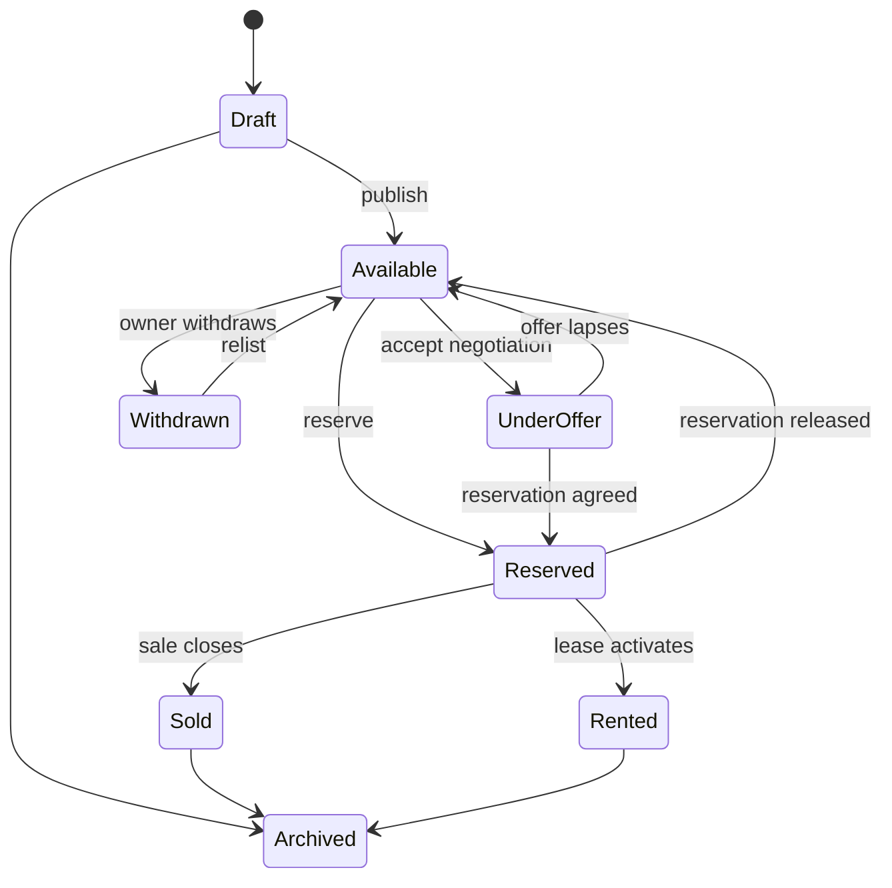

# Property Lifecycle

Transitions emit PropertyCreated, PropertyPublished, PropertyReserved, PropertyOfferReceived, PropertySold, PropertyRented, PropertyWithdrawn, PropertyRelisted, and PropertyArchived. Preconditions such as mandate, compliance, pricing, required media, or availability are policy/configuration concerns. History is immutable; current state is a projection.
