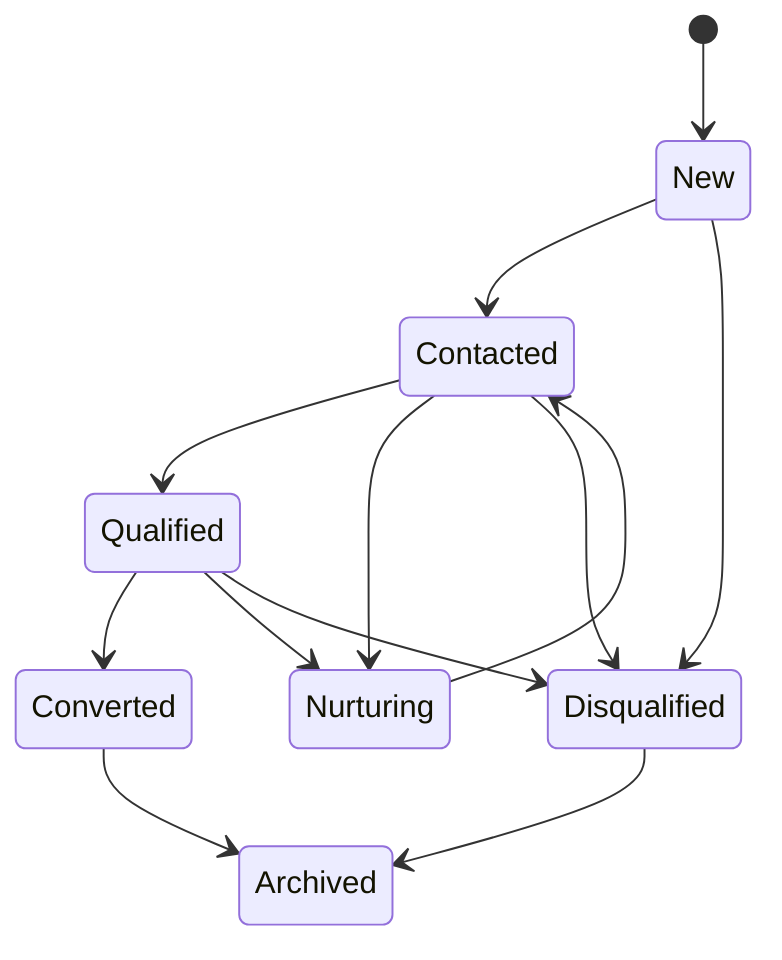

# Lead Lifecycle

Events: LeadCreated, LeadAssigned, LeadContacted, LeadQualified, LeadNurtured, LeadDisqualified, LeadConverted, LeadArchived. Duplicate detection links or merges under a governed process and preserves aliases/audit. Conversion creates or associates a Deal; it does not erase the Lead.
