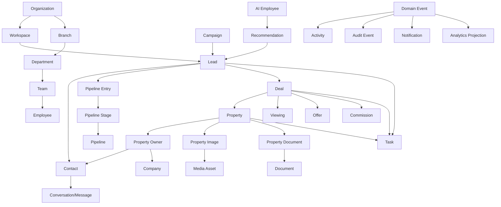

# Data Relationships

All tenant-owned records belong to one Organization. Workspace, branch, team, and employee add operational scope. Cross-aggregate references use IDs; event consumers build projections. Contact is the person, Company the business party, Organization the tenant, Employee the workforce membership, Lead the interest, Deal the transaction, and Property the asset.
