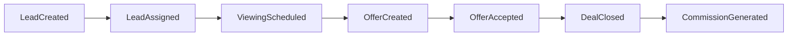

# Event Architecture

## Envelope

Every event has `eventId`, `eventType`, `schemaVersion`, `organizationId`, optional `workspaceId`, aggregate type/id/version, `occurredAt`, actor, correlation ID, causation ID, idempotency key, classification, and payload. Names are past tense. Published schemas are backward compatible; breaking meaning creates a new version.

## Core flow

## Event catalog

- Tenancy: OrganizationCreated/Activated/Suspended/Archived; WorkspaceCreated/Activated/Suspended; EmployeeAdded/Assigned/Deactivated; RoleAssigned/Revoked.
- Party: ContactCreated/Updated/Merged/ConsentChanged; CompanyCreated/Linked/Updated.
- Property: PropertyCreated/Updated/Published/Reserved/OfferReceived/Sold/Rented/Withdrawn/Archived; PricingChanged; PropertyOwnerLinked; MediaAttached; DocumentLinked.
- Revenue: LeadCreated/Assigned/Contacted/Qualified/Nurtured/Disqualified/Converted/Archived; PipelineStageChanged; DealCreated/Updated/Won/Lost/Cancelled; ViewingRequested/Scheduled/Confirmed/Completed/Cancelled/NoShow; OfferCreated/Submitted/Countered/Accepted/Rejected/Expired; CommissionGenerated/Approved/Paid.
- Work/content: TaskCreated/Assigned/Completed/Reopened/Archived; CalendarEventCreated/Rescheduled/Cancelled; DocumentCreated/Versioned/Approved/Signed/Expired; MediaAvailable/Quarantined.
- Growth: CampaignCreated/Scheduled/Launched/Paused/Completed; EngagementRecorded; LeadAttributed.
- AI/automation: AIRecommendationCreated/Approved/Rejected; AIExecutionStarted/Paused/Completed/Failed; MemoryFactExtracted/Verified/Superseded; WorkflowPublished/Started/StepCompleted/WaitingForApproval/Completed/Failed.
- Platform: NotificationCreated/Delivered/Read; SubscriptionActivated/Changed/Suspended/Cancelled; UsageRecorded; IntegrationActivated/Degraded/Revoked; AuditExported.

Consumers include activity, audit, notifications, search indexing, analytics, automation, integrations, and AI memory. Delivery is at-least-once; consumers are idempotent. Ordering is guaranteed only per aggregate. Personal data minimization, retention, replay authorization, dead-letter handling, traceability, and outbox publication are mandatory implementation policies.
