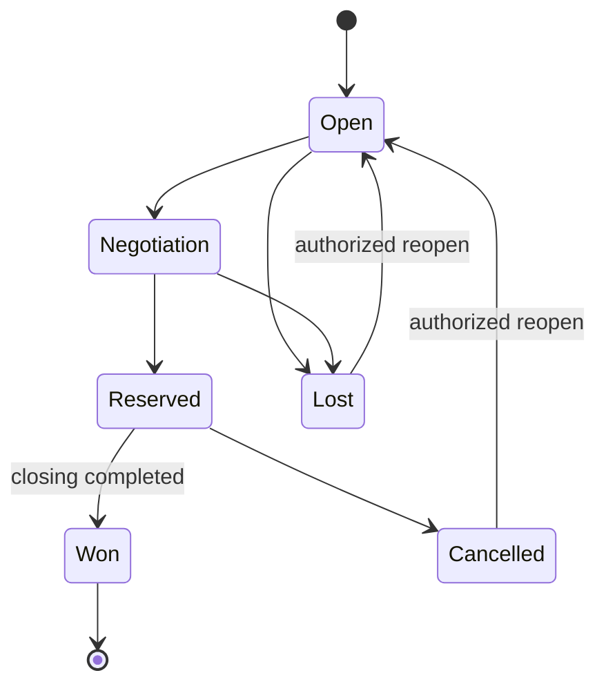

# Deal Lifecycle

Creation requires property and participant context. Negotiation aggregates offers without treating an offer as the deal. Reservation is a governed hold, not closing. Won requires completion evidence; commission generation follows DealClosed. Every transition records reason, actor, aggregate version, correlation, and emits a domain event. Loss/cancellation reasons and reopening policy are configurable.
