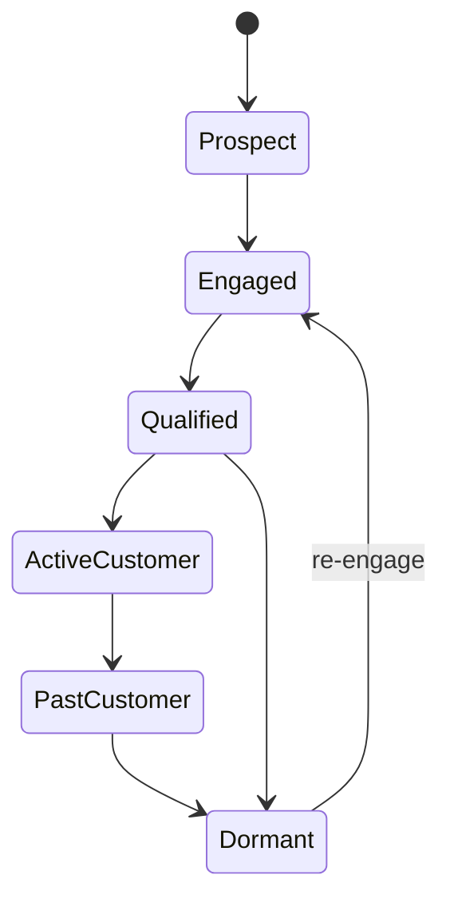

# Customer Lifecycle

This classifies the organization's relationship with a Contact or Company and is independent of Lead and Deal state. A party may hold multiple contextual roles and journeys. Consent, suppression, identity merge, retention, VIP/risk classification, and jurisdictional rules constrain engagement. Transitions emit CustomerEngaged, CustomerQualified, CustomerActivated, CustomerCompleted, CustomerDormant, and CustomerReengaged.
