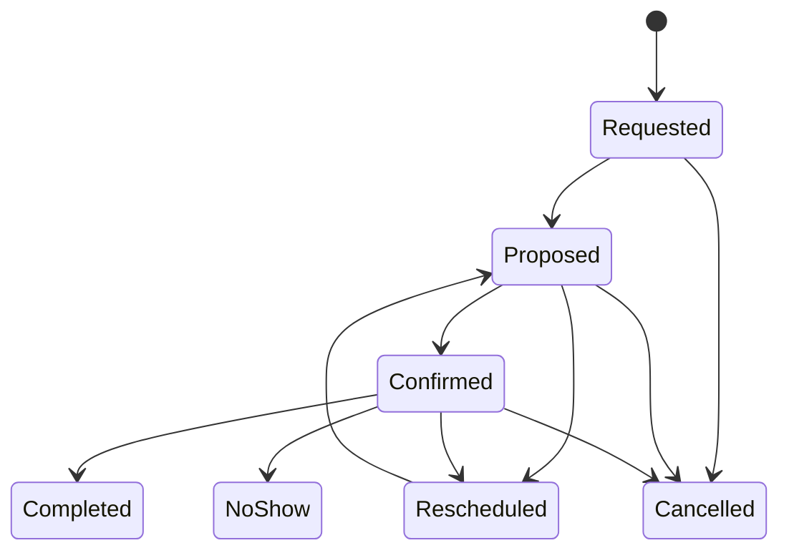

# Viewing Lifecycle

A Viewing binds lead/contact, property, attendees, time, timezone, location/channel, and optional deal. Confirmation requires valid availability and participant acknowledgement. Rescheduling creates history rather than overwriting evidence. No availability or booking promise may be inferred by AI without authoritative confirmation.
