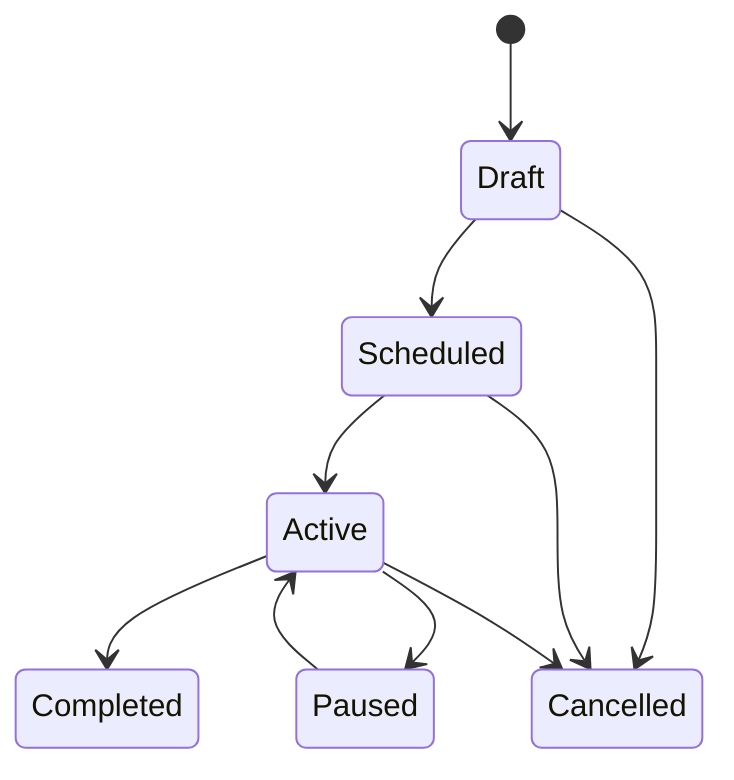

# Marketing Lifecycle

Publication requires audience, channel, content, budget, schedule, consent policy, and accountable owner. Audience definitions and content versions are frozen for measurement at launch. Engagement and attribution are events. Pausing stops new dispatch without deleting evidence. Completion preserves spend, reach, attribution, and generated-lead projections.
